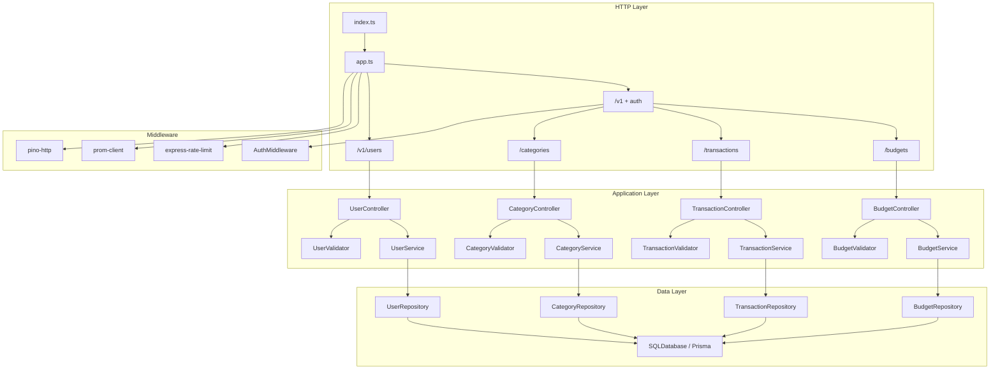

# Personal Expense Tracker API

A TypeScript REST API for personal finance: user authentication, categories (inflow/outflow), transactions, and monthly budgets per category. Built with Express 5, Prisma, and PostgreSQL.

## Features

| Feature | Purpose |
|--------|---------|
| **Layered architecture** | Routes → controllers → validators → services → repositories → database |
| **JWT authentication** | Bearer tokens on protected routes; payload carries `id` and `email` |
| **Categories** | Inflow/outflow categories with per-user display order (auto-assigned on create, reorderable) |
| **Transactions** | CRUD linked to categories; status set to `COMPLETED` on create |
| **Budgets** | Monthly budgets per outflow category (one budget per category per UTC month) |
| **Rate limiting** | Global API limit plus separate limits for registration and login |
| **Request validation** | Joi schemas for request bodies and route params |
| **Structured logging** | Pino HTTP logging with sensitive field redaction |
| **Metrics** | Prometheus histograms/counters on `/metrics` (token-protected) |
| **Health checks** | `/health` (liveness) and `/ready` (database connectivity) |
| **Graceful shutdown** | `SIGINT` / `SIGTERM` disconnect Prisma before exit |
| **Testing** | Vitest unit tests + Supertest integration tests (130+ tests) |
| **CI** | GitHub Actions runs typecheck and tests on push to `master` and on pull requests |

## Architecture



### Layer responsibilities

| Layer | Role |
|-------|------|
| **Routes** | Wire HTTP verbs, rate limiters, and controller handlers |
| **Controllers** | Parse requests, call validators/services, shape HTTP responses |
| **Validators** | Joi validation; throw `AppError(400)` on invalid input |
| **Services** | Business rules (auth, ownership, category order, budget limits, transaction rules) |
| **Repositories** | Prisma queries; accept `PrismaClient` via constructor |
| **Middleware** | Auth (`Authorization: Bearer`), rate limits, logging, metrics |

### Data model

| Model | Key fields | Notes |
|-------|------------|--------|
| **User** | `email`, `password` (hashed) | Owns categories, transactions, budgets |
| **Category** | `name`, `flowType`, `order` | `order` is per-user; unique sequence for display |
| **Transaction** | `title`, `amount`, `date`, `status`, `categoryId` | Create API sets `status` to `COMPLETED` |
| **Budget** | `amount`, `date`, `categoryId` | `date` stored as month start (UTC); outflow categories only |

Enums: `FlowType` (`INFLOW`, `OUTFLOW`), `TransactionStatus` (`PENDING`, `COMPLETED`, `CANCELLED`).

Schema and migrations live in [`src/prisma/`](src/prisma/).

### API response contract

Success (read / update):

```json
{ "message": null, "data": { } }
```

Success (create / update / delete with action message):

```json
{ "message": "Category created successfully", "data": { } }
```

Error (global handler, rate limiter, `AppError`):

```json
{ "message": "Human-readable error" }
```

## Packages

### Runtime dependencies

| Package | Used for |
|---------|----------|
| **express** | HTTP server, routing, middleware pipeline |
| **@prisma/client** + **@prisma/adapter-pg** | Type-safe ORM and PostgreSQL driver adapter |
| **pg** | PostgreSQL client used by Prisma adapter |
| **joi** | Request body and param validation |
| **jsonwebtoken** | Sign login tokens and verify Bearer tokens (HS256 only) |
| **bcrypt** | Password hashing and comparison |
| **express-rate-limit** | API-wide, registration, and login rate limits |
| **dotenv** | Load environment variables |
| **pino** + **pino-http** | Structured JSON logging per request |
| **prom-client** | Prometheus metrics (`http_requests_total`, request duration) |

### Dev dependencies

| Package | Used for |
|---------|----------|
| **typescript** | Static typing and `tsc --noEmit` checks |
| **tsx** | Run and watch TypeScript in development |
| **prisma** | Migrations and client generation |
| **vitest** | Unit and integration test runner |
| **supertest** | HTTP integration tests against the Express app |
| **@types/\*** | Type definitions for Node, Express, bcrypt, JWT, pg, supertest |

## API endpoints

### Public

| Method | Path | Description |
|--------|------|-------------|
| `POST` | `/v1/users` | Register user |
| `POST` | `/v1/users/login` | Login; returns JWT |
| `GET` | `/health` | Liveness |
| `GET` | `/ready` | Readiness (DB ping) |
| `GET` | `/metrics` | Prometheus scrape (requires `Authorization: Bearer <METRICS_TOKEN>`) |

### Protected (JWT required)

All protected routes require:

```http
Authorization: Bearer <token>
```

#### Categories (`/v1/categories`)

| Method | Path | Description |
|--------|------|-------------|
| `GET` | `/v1/categories` | List categories (sorted by `order`) |
| `GET` | `/v1/categories/:id` | Get one category |
| `POST` | `/v1/categories` | Create category (order assigned automatically: 1, 2, 3, …) |
| `PATCH` | `/v1/categories/:id` | Update name, `flowType`, and/or `order` |
| `DELETE` | `/v1/categories/:id` | Delete category (remaining orders renumbered) |

**Create body:**

```json
{
  "name": "Groceries",
  "flowType": "OUTFLOW"
}
```

`flowType`: `INFLOW` or `OUTFLOW`.

**Update body (at least one field):**

```json
{
  "name": "Food",
  "flowType": "OUTFLOW",
  "order": 2
}
```

#### Transactions (`/v1/transactions`)

| Method | Path | Description |
|--------|------|-------------|
| `GET` | `/v1/transactions` | Last 10 transactions (all categories, newest first) |
| `GET` | `/v1/transactions/current-month` | Up to 20 transactions in the current UTC month, grouped by category |
| `POST` | `/v1/transactions` | Create transaction (`status` always `COMPLETED`; not accepted in body) |
| `PATCH` | `/v1/transactions/:id` | Update transaction (partial body) |
| `DELETE` | `/v1/transactions/:id` | Delete transaction |

**Create body:**

```json
{
  "title": "Coffee",
  "amount": 4.5,
  "categoryId": 3,
  "description": "Morning coffee",
  "date": "2024-06-15T12:00:00.000Z"
}
```

| Field | Rules |
|-------|--------|
| `title` | Required |
| `amount` | Required, must be **> 0** |
| `categoryId` | Required; must belong to the user |
| `description` | Optional |
| `date` | Optional ISO date; defaults to now |

**Update body (at least one field):** `title`, `amount` (> 0), `categoryId`, `description`, `date`.

**Current month response shape** — array of groups:

```json
{
  "message": null,
  "data": [
    {
      "category": {
        "id": 3,
        "name": "Food",
        "flowType": "OUTFLOW",
        "order": 1,
        "transactions": [
          { "id": 20, "title": "Coffee", "amount": 4.5, "description": null, "date": "2024-06-01T10:00:00.000Z" }
        ]
      }
    }
  ]
}
```

Groups are sorted by category `order`. Only the 20 most recent transactions in the month are included (across all categories).

#### Budgets (`/v1/budgets`)

| Method | Path | Description |
|--------|------|-------------|
| `POST` | `/v1/budgets` | Create monthly budget for an outflow category |
| `PATCH` | `/v1/budgets/:id` | Update budget amount only |
| `DELETE` | `/v1/budgets/:id` | Delete budget |

**Rules:**

- Budgets are tied to a **category** (`categoryId`).
- Only **OUTFLOW** categories can have budgets.
- **One budget per category per UTC month** (duplicate returns `409`).
- Month is derived from optional `date` (defaults to current month); stored as the first day of that month (UTC).

**Create body:**

```json
{
  "categoryId": 3,
  "amount": 500,
  "date": "2024-06-15T12:00:00.000Z"
}
```

**Update body:**

```json
{
  "amount": 750
}
```

### Common HTTP status codes

| Code | Typical cause |
|------|----------------|
| `400` | Validation error or business rule (e.g. inflow category budget) |
| `401` | Missing/invalid JWT |
| `404` | Resource not found or not owned by user |
| `409` | Conflict (duplicate email, duplicate monthly budget) |

## Project structure

```
.github/workflows/       # CI (GitHub Actions)
src/
├── app.ts                 # Express app factory
├── index.ts               # Server entry + graceful shutdown
├── config/                # Prometheus metrics
├── controllers/           # HTTP handlers
├── database/              # Prisma singleton
├── generated/prisma/      # Generated Prisma client
├── interfaces/            # Types + layer contracts (I*Service, I*Repository, …)
├── middlewares/           # Auth, rate limiting
├── plugins/               # Logger
├── prisma/                # Schema + migrations
├── repositories/          # Data access
├── routes/                # Route modules + integration tests
├── services/              # Business logic
├── types/                 # Express augmentation (req.user)
├── utils/                 # JWT, bcrypt, AppError, date helpers (UTC month ranges)
└── validators/            # Joi validators
```

## Getting started

### Prerequisites

- Node.js 22
- PostgreSQL (local or Docker)

### Setup

```bash
cp .env_copy .env
# Edit DATABASE_URL and JWT_SECRET

npm install
npx prisma migrate deploy
npx prisma generate
npm run dev
```

Server runs at `http://localhost:3000`.

## Production Docker image

Multi-stage image: compile TypeScript, run Prisma migrations on start, then `node dist/index.js`.

| File | Purpose |
|------|---------|
| [`Dockerfile`](Dockerfile) | Production image (non-root user, `dumb-init`, health check on `/health`) |
| [`Dockerfile.dev`](Dockerfile.dev) | Local dev with hot reload |
| [`scripts/docker-prod-entrypoint.sh`](scripts/docker-prod-entrypoint.sh) | `prisma migrate deploy` + start API |

```bash
npm run build
docker build -t expense-tracker-api .
docker run --rm -p 3000:3000 \
  -e DATABASE_URL="postgresql://..." \
  -e JWT_SECRET="..." \
  -e METRICS_TOKEN="..." \
  expense-tracker-api
```

## Deploy to AWS (Terraform)

Infrastructure lives in [`terraform/`](terraform/) — **eu-north-1 (Stockholm)**, **ECS Fargate** (no EC2), **RDS PostgreSQL**, **HTTPS** on your custom domain, **staging + prod** environments, and **GitHub Actions** deploys.

| AWS service | Role |
|-------------|------|
| ECS Fargate | API containers (autoscale 1–3 tasks per env) |
| ALB | HTTPS termination and load balancing |
| ACM + Route 53 | TLS certificate and DNS (optional manual DNS) |
| RDS PostgreSQL 17 | Per-environment database |
| ECR | Per-environment container registry |
| Secrets Manager | App secrets per environment |

**Full guide:** [terraform/README.md](terraform/README.md)

```bash
# 1) GitHub OIDC (once)
cd terraform/bootstrap && terraform apply

# 2) Staging then prod
cd terraform/environments/staging && cp terraform.tfvars.example terraform.tfvars && terraform apply
cd terraform/environments/prod    && cp terraform.tfvars.example terraform.tfvars && terraform apply

# 3) Push to main → deploy-staging workflow; prod via "Deploy Production" workflow
```

**Domains:** production API at `https://api.personalexpensetracker.site`, staging at `https://staging-api.personalexpensetracker.site`. DNS is on **Namecheap** — see [terraform/NAMECHEAP_DNS.md](terraform/NAMECHEAP_DNS.md). [www.personalexpensetracker.site](https://www.personalexpensetracker.site/) stays on nginx.

## Run with Docker locally

The dev stack runs the API, PostgreSQL, Prometheus, Grafana, and pgAdmin together via `docker-compose.dev.yml`.

### Prerequisites

- [Docker Desktop](https://www.docker.com/products/docker-desktop/) (or Docker Engine + Docker Compose v2)
- Git clone of this repository

### 1. Configure environment

Create a `.env` file in the project root (the app container mounts it for `JWT_SECRET` and other secrets):

```bash
cp .env_copy .env
```

Edit `.env` at minimum:

```env
JWT_SECRET=your-local-jwt-secret
METRICS_TOKEN=change-this-to-a-long-random-secret
```

`METRICS_TOKEN` must match the Bearer token in `prometheus.yml` (`authorization.credentials`) so Prometheus can scrape `/metrics`.

You do **not** need to set `DATABASE_URL` in `.env` for Docker: Compose injects it for the app service:

`postgresql://postgres:postgres@db:5432/expense_tracker`

### 2. Start the stack

From the project root:

```bash
docker compose -f docker-compose.dev.yml up --build
```

Add `-d` to run in the background:

```bash
docker compose -f docker-compose.dev.yml up --build -d
```

On first start, Compose will:

1. Start PostgreSQL and wait until it is healthy
2. Build `Dockerfile.dev` (Node 22, `npm install`, `prisma generate`)
3. Run [`scripts/docker-dev-entrypoint.sh`](scripts/docker-dev-entrypoint.sh): `prisma migrate deploy`, then `npm run dev` (hot reload via mounted source)
4. Start Prometheus, Grafana, and pgAdmin

Migrations run automatically before the API starts. To apply migrations manually (e.g. after pulling new migration files without restarting):

```bash
docker compose -f docker-compose.dev.yml exec app npx prisma migrate deploy
```

### 3. Verify the API

```bash
curl http://localhost:3000/health
curl http://localhost:3000/ready
```

Register and log in:

```bash
curl -s -X POST http://localhost:3000/v1/users \
  -H "Content-Type: application/json" \
  -d '{"firstName":"Jane","lastName":"Doe","email":"jane@example.com","password":"password123"}'

curl -s -X POST http://localhost:3000/v1/users/login \
  -H "Content-Type: application/json" \
  -d '{"email":"jane@example.com","password":"password123"}'
```

Use the token from the login response as `Authorization: Bearer <token>` on `/v1/categories`, `/v1/transactions`, and `/v1/budgets` routes.

Example — create an outflow category, transaction, and budget:

```bash
# Create category
curl -s -X POST http://localhost:3000/v1/categories \
  -H "Authorization: Bearer $TOKEN" \
  -H "Content-Type: application/json" \
  -d '{"name":"Groceries","flowType":"OUTFLOW"}'

# Create transaction (categoryId from previous response)
curl -s -X POST http://localhost:3000/v1/transactions \
  -H "Authorization: Bearer $TOKEN" \
  -H "Content-Type: application/json" \
  -d '{"title":"Coffee","amount":4.5,"categoryId":3}'

# Create monthly budget for the same category
curl -s -X POST http://localhost:3000/v1/budgets \
  -H "Authorization: Bearer $TOKEN" \
  -H "Content-Type: application/json" \
  -d '{"categoryId":3,"amount":500}'
```

### Services and ports

| Service | URL | Notes |
|---------|-----|--------|
| **API** | http://localhost:3000 | Express app |
| **PostgreSQL** | `localhost:5432` | User `postgres` / password `postgres`, DB `expense_tracker` |
| **Prometheus** | http://localhost:9090 | Scrapes app metrics |
| **Grafana** | http://localhost:3001 | Login `admin` / `admin` |
| **pgAdmin** | http://localhost:5050 | Login `admin@example.com` / `admin123` |

**pgAdmin — connect to Postgres**

- Host: `db` (from another container) or `host.docker.internal` / `localhost` from your machine
- Port: `5432`
- Username: `postgres`
- Password: `postgres`
- Database: `expense_tracker`

### Useful Docker commands

```bash
# Follow API logs
docker compose -f docker-compose.dev.yml logs -f app

# Stop containers (keep data volumes)
docker compose -f docker-compose.dev.yml down

# Stop and remove volumes (fresh database)
docker compose -f docker-compose.dev.yml down -v

# Rebuild after dependency changes
docker compose -f docker-compose.dev.yml up --build

# Shell inside the app container
docker compose -f docker-compose.dev.yml exec app sh

# Run tests inside the app container
docker compose -f docker-compose.dev.yml exec app npm test
```

### Environment variables

| Variable | Purpose |
|----------|---------|
| `DATABASE_URL` | PostgreSQL connection string |
| `JWT_SECRET` | Secret for signing/verifying JWTs |
| `METRICS_TOKEN` | Bearer token for `/metrics` |
| `RATE_LIMIT_WINDOW_MS` / `RATE_LIMIT_MAX` | Global API rate limit |
| `REGISTER_RATE_LIMIT_*` | Registration endpoint limit |
| `LOGIN_RATE_LIMIT_*` | Login endpoint limit (skips successful logins) |

## Scripts

| Command | Description |
|---------|-------------|
| `npm run build` | Compile TypeScript to `dist/` |
| `npm start` | Run compiled API (`node dist/index.js`) |
| `npm run dev` | Start API with hot reload (`tsx watch`) |
| `npm test` | Run all Vitest tests |
| `npm run test:coverage` | Run tests with V8 coverage report |
| `npm run test:watch` | Vitest watch mode |
| `npm run typecheck` | TypeScript check without emit |

## Testing

**130 tests** across **19 files** (unit + integration).

Tests are split by layer:

| Type | Location | What it covers |
|------|----------|----------------|
| **Unit** | `*.test.ts` next to source | Services, controllers, validators, JWT, auth middleware |
| **Integration** | `src/routes/*.integration.test.ts` | Full HTTP stack via Supertest (mocked services / JWT) |

Run everything:

```bash
npm test
```

### Test coverage

Coverage uses [`@vitest/coverage-v8`](https://vitest.dev/guide/coverage.html). Generate a terminal summary and HTML report under `coverage/`:

```bash
npm run test:coverage
```

Open the HTML report: `coverage/index.html`.

**Overall (last measured):**

| Metric | Coverage |
|--------|----------|
| Statements | ~76% |
| Lines | ~76% |
| Functions | ~76% |
| Branches | ~60% |

**By layer:**

| Layer | Statement coverage | Notes |
|-------|-------------------|--------|
| Services | ~96% | Business rules; primary unit-test focus |
| Controllers | ~100% | Unit tests + integration routes |
| Validators | ~100% | Joi schemas |
| Routes | ~100% | HTTP wiring via Supertest |
| Middleware (auth) | ~96% | JWT verification |
| Repositories | ~6% | Prisma queries not exercised — integration tests mock services |
| App / infra | Mixed | `app.ts` health/ready/metrics paths, `logger.ts`, `metrics.ts` partially covered |

**Not executed in tests:** `src/index.ts` (server bootstrap), `src/database/index.ts` (Prisma singleton lifecycle).

CI runs `npm test` only (no coverage gate). Re-run `npm run test:coverage` locally after changes to refresh numbers.

## Continuous integration

[`.github/workflows/ci.yml`](.github/workflows/ci.yml) runs on **push to `master`** and on **all pull requests**.

| Step | Command |
|------|---------|
| Install | `npm ci` |
| Prisma client | `npx prisma generate` |
| Typecheck | `npm run typecheck` |
| Test | `npm test` |

The workflow uses **Node.js 22** on `ubuntu-latest` (same major version as `Dockerfile.dev`). No database is required in CI — tests mock services and the database layer.

To reproduce CI locally:

```bash
npm ci
npx prisma generate
npm run typecheck
npm test
```

## Security notes

- JWTs are signed with **HS256**; verification pins `algorithms: ['HS256']` to block algorithm-confusion attacks.
- Passwords are never returned in API responses (`IUserResponse` omits `password`).
- Login and registration use dedicated, stricter rate limiters than the general API.
- Protected routes scope all queries by `req.user.id` from the JWT (categories, transactions, budgets).
- Transaction `status` is set server-side on create (`COMPLETED`); clients cannot override it.
- Budgets are limited to outflow categories with at most one entry per category per UTC month.

## License

ISC
