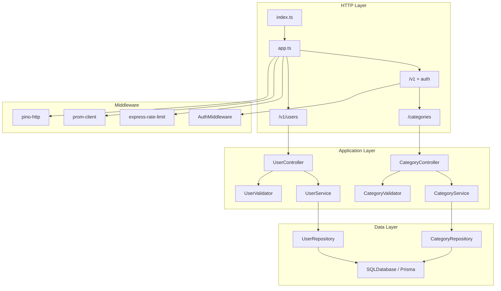

# Personal Expense Tracker API

A TypeScript REST API for user authentication and expense categories (inflow/outflow), built with Express 5, Prisma, and PostgreSQL.

## Features

| Feature | Purpose |
|--------|---------|
| **Layered architecture** | Routes → controllers → validators → services → repositories → database |
| **JWT authentication** | Bearer tokens on protected routes; payload carries `id` and `email` |
| **Rate limiting** | Global API limit plus separate limits for registration and login |
| **Request validation** | Joi schemas for request bodies and route params |
| **Structured logging** | Pino HTTP logging with sensitive field redaction |
| **Metrics** | Prometheus histograms/counters on `/metrics` (token-protected) |
| **Health checks** | `/health` (liveness) and `/ready` (database connectivity) |
| **Graceful shutdown** | `SIGINT` / `SIGTERM` disconnect Prisma before exit |
| **Testing** | Vitest unit tests + Supertest integration tests |

## Architecture



### Layer responsibilities

| Layer | Role |
|-------|------|
| **Routes** | Wire HTTP verbs, rate limiters, and controller handlers |
| **Controllers** | Parse requests, call validators/services, shape HTTP responses |
| **Validators** | Joi validation; throw `AppError(400)` on invalid input |
| **Services** | Business rules (duplicate email, credentials, ownership) |
| **Repositories** | Prisma queries; accept `PrismaClient` via constructor |
| **Middleware** | Auth (`Authorization: Bearer`), rate limits, logging, metrics |

### API response contract

Success (read / update):

```json
{ "message": null, "data": { } }
```

Success (create / update / delete with action message):

```json
{ "message": "Category created successfully", "data": { } }
```

Error (global handler, rate limiter, `AppError`):

```json
{ "message": "Human-readable error" }
```

## Packages

### Runtime dependencies

| Package | Used for |
|---------|----------|
| **express** | HTTP server, routing, middleware pipeline |
| **@prisma/client** + **@prisma/adapter-pg** | Type-safe ORM and PostgreSQL driver adapter |
| **pg** | PostgreSQL client used by Prisma adapter |
| **joi** | Request body and param validation |
| **jsonwebtoken** | Sign login tokens and verify Bearer tokens (HS256 only) |
| **bcrypt** | Password hashing and comparison |
| **express-rate-limit** | API-wide, registration, and login rate limits |
| **dotenv** | Load environment variables |
| **pino** + **pino-http** | Structured JSON logging per request |
| **prom-client** | Prometheus metrics (`http_requests_total`, request duration) |

### Dev dependencies

| Package | Used for |
|---------|----------|
| **typescript** | Static typing and `tsc --noEmit` checks |
| **tsx** | Run and watch TypeScript in development |
| **prisma** | Migrations and client generation |
| **vitest** | Unit and integration test runner |
| **supertest** | HTTP integration tests against the Express app |
| **@types/\*** | Type definitions for Node, Express, bcrypt, JWT, pg, supertest |

## API endpoints

### Public

| Method | Path | Description |
|--------|------|-------------|
| `POST` | `/v1/users` | Register user |
| `POST` | `/v1/users/login` | Login; returns JWT |
| `GET` | `/health` | Liveness |
| `GET` | `/ready` | Readiness (DB ping) |
| `GET` | `/metrics` | Prometheus scrape (requires `Authorization: Bearer <METRICS_TOKEN>`) |

### Protected (JWT required)

| Method | Path | Description |
|--------|------|-------------|
| `GET` | `/v1/categories` | List categories for authenticated user |
| `GET` | `/v1/categories/:id` | Get one category |
| `POST` | `/v1/categories` | Create category |
| `PATCH` | `/v1/categories/:id` | Update category (partial body) |
| `DELETE` | `/v1/categories/:id` | Delete category |

**Auth header:** `Authorization: Bearer <token>`

**Category body example:**

```json
{
  "name": "Groceries",
  "flowType": "OUTFLOW"
}
```

`flowType` is `INFLOW` or `OUTFLOW`.

## Project structure

```
src/
├── app.ts                 # Express app factory
├── index.ts               # Server entry + graceful shutdown
├── config/                # Prometheus metrics
├── controllers/           # HTTP handlers
├── database/              # Prisma singleton
├── generated/prisma/      # Generated Prisma client
├── interfaces/            # Types + layer contracts (I*Service, I*Repository, …)
├── middlewares/           # Auth, rate limiting
├── plugins/               # Logger
├── prisma/                # Schema + migrations
├── repositories/          # Data access
├── routes/                # Route modules + integration tests
├── services/              # Business logic
├── types/                 # Express augmentation (req.user)
├── utils/                 # JWT, bcrypt, AppError
└── validators/            # Joi validators
```

## Getting started

### Prerequisites

- Node.js 20+
- PostgreSQL (local or Docker)

### Setup

```bash
cp .env_copy .env
# Edit DATABASE_URL and JWT_SECRET

npm install
npx prisma migrate deploy
npx prisma generate
npm run dev
```

Server runs at `http://localhost:3000`.

## Run with Docker locally

The dev stack runs the API, PostgreSQL, Prometheus, Grafana, and pgAdmin together via `docker-compose.dev.yml`.

### Prerequisites

- [Docker Desktop](https://www.docker.com/products/docker-desktop/) (or Docker Engine + Docker Compose v2)
- Git clone of this repository

### 1. Configure environment

Create a `.env` file in the project root (the app container mounts it for `JWT_SECRET` and other secrets):

```bash
cp .env_copy .env
```

Edit `.env` at minimum:

```env
JWT_SECRET=your-local-jwt-secret
METRICS_TOKEN=change-this-to-a-long-random-secret
```

`METRICS_TOKEN` must match the Bearer token in `prometheus.yml` (`authorization.credentials`) so Prometheus can scrape `/metrics`.

You do **not** need to set `DATABASE_URL` in `.env` for Docker: Compose injects it for the app service:

`postgresql://postgres:postgres@db:5432/expense_tracker`

### 2. Start the stack

From the project root:

```bash
docker compose -f docker-compose.dev.yml up --build
```

Add `-d` to run in the background:

```bash
docker compose -f docker-compose.dev.yml up --build -d
```

On first start, Compose will:

1. Start PostgreSQL and wait until it is healthy
2. Build `Dockerfile.dev` (Node 22, `npm install`, `prisma generate`)
3. Run [`scripts/docker-dev-entrypoint.sh`](scripts/docker-dev-entrypoint.sh): `prisma migrate deploy`, then `npm run dev` (hot reload via mounted source)
4. Start Prometheus, Grafana, and pgAdmin

Migrations run automatically before the API starts. To apply migrations manually (e.g. after pulling new migration files without restarting):

```bash
docker compose -f docker-compose.dev.yml exec app npx prisma migrate deploy
```

### 3. Verify the API

```bash
curl http://localhost:3000/health
curl http://localhost:3000/ready
```

Register and log in:

```bash
curl -s -X POST http://localhost:3000/v1/users \
  -H "Content-Type: application/json" \
  -d '{"firstName":"Jane","lastName":"Doe","email":"jane@example.com","password":"password123"}'

curl -s -X POST http://localhost:3000/v1/users/login \
  -H "Content-Type: application/json" \
  -d '{"email":"jane@example.com","password":"password123"}'
```

Use the `data` token from login as `Authorization: Bearer <token>` on `/v1/categories` routes.

### Services and ports

| Service | URL | Notes |
|---------|-----|--------|
| **API** | http://localhost:3000 | Express app |
| **PostgreSQL** | `localhost:5432` | User `postgres` / password `postgres`, DB `expense_tracker` |
| **Prometheus** | http://localhost:9090 | Scrapes app metrics |
| **Grafana** | http://localhost:3001 | Login `admin` / `admin` |
| **pgAdmin** | http://localhost:5050 | Login `admin@example.com` / `admin123` |

**pgAdmin — connect to Postgres**

- Host: `db` (from another container) or `host.docker.internal` / `localhost` from your machine
- Port: `5432`
- Username: `postgres`
- Password: `postgres`
- Database: `expense_tracker`

### Useful Docker commands

```bash
# Follow API logs
docker compose -f docker-compose.dev.yml logs -f app

# Stop containers (keep data volumes)
docker compose -f docker-compose.dev.yml down

# Stop and remove volumes (fresh database)
docker compose -f docker-compose.dev.yml down -v

# Rebuild after dependency changes
docker compose -f docker-compose.dev.yml up --build

# Shell inside the app container
docker compose -f docker-compose.dev.yml exec app sh

# Run tests inside the app container
docker compose -f docker-compose.dev.yml exec app npm test
```

### Environment variables

| Variable | Purpose |
|----------|---------|
| `DATABASE_URL` | PostgreSQL connection string |
| `JWT_SECRET` | Secret for signing/verifying JWTs |
| `METRICS_TOKEN` | Bearer token for `/metrics` |
| `RATE_LIMIT_WINDOW_MS` / `RATE_LIMIT_MAX` | Global API rate limit |
| `REGISTER_RATE_LIMIT_*` | Registration endpoint limit |
| `LOGIN_RATE_LIMIT_*` | Login endpoint limit (skips successful logins) |

## Scripts

| Command | Description |
|---------|-------------|
| `npm run dev` | Start API with hot reload (`tsx watch`) |
| `npm test` | Run all Vitest tests |
| `npm run test:watch` | Vitest watch mode |
| `npm run typecheck` | TypeScript check without emit |

## Testing

Tests are split by layer:

| Type | Location | What it covers |
|------|----------|----------------|
| **Unit** | `*.test.ts` next to source | Services, controllers, validators, JWT, auth middleware |
| **Integration** | `src/routes/*.integration.test.ts` | Full HTTP stack via Supertest (mocked services / JWT) |

Run everything:

```bash
npm test
```

## Security notes

- JWTs are signed with **HS256**; verification pins `algorithms: ['HS256']` to block algorithm-confusion attacks.
- Passwords are never returned in API responses (`IUserResponse` omits `password`).
- Login and registration use dedicated, stricter rate limiters than the general API.
- Protected category routes scope all queries by `req.user.id` from the JWT.

## License

ISC
