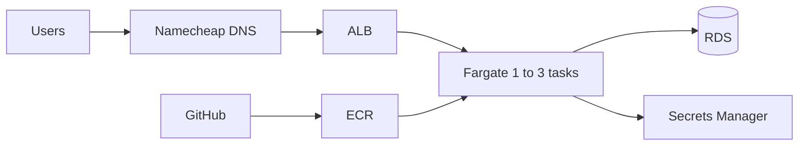

# AWS deployment (Terraform)

**Region:** `eu-north-1` (Stockholm) — low latency to Denmark.

**Compute:** ECS Fargate (no EC2) behind an ALB.

**Database:** RDS PostgreSQL 17 (private subnets).

**Environments:** separate `staging` and `prod` stacks (isolated VPCs, ECR repos, RDS, secrets).

## Architecture



| Feature | Implementation |
|---------|----------------|
| HTTPS | ACM certificate + ALB TLS listener |
| Custom domain | **Namecheap** CNAME to ALB + ACM DNS validation ([guide](NAMECHEAP_DNS.md)) |
| Scale 1→3 | Application Auto Scaling on CPU and ALB requests per target |
| CI/CD | GitHub Actions OIDC → ECR push → ECS rolling deploy |

## Layout

```
terraform/
├── bootstrap/              # One-time GitHub OIDC IAM roles (per AWS account)
├── modules/api/            # Shared infrastructure module
└── environments/
    ├── staging/            # staging-api.personalexpensetracker.site
    └── prod/               # api.personalexpensetracker.site
```

## Domain layout (`personalexpensetracker.site`)

| Hostname | Purpose |
|----------|---------|
| [www.personalexpensetracker.site](https://www.personalexpensetracker.site/) | Existing nginx site (frontend / placeholder) — **unchanged** by this stack |
| `api.personalexpensetracker.site` | **Production** API (ALB + ECS) |
| `staging-api.personalexpensetracker.site` | **Staging** API |

The Terraform stack does **not** change `www` (your nginx site). You only add `api` and `staging-api` in Namecheap.

## DNS on Namecheap

**Full guide:** **[NAMECHEAP_DNS.md](NAMECHEAP_DNS.md)**

1. `terraform apply` (staging or prod)
2. Add ACM validation CNAMEs from `terraform output namecheap_dns`
3. `terraform apply` again
4. Add API **CNAME** (`api` / `staging-api` → ALB hostname)
5. `curl https://api.personalexpensetracker.site/health`

Leave `route53_zone_id` and `route53_zone_name` **empty** in `terraform.tfvars`.

## Prerequisites

- AWS account, Terraform >= 1.5, Docker, AWS CLI
- Domain `personalexpensetracker.site` on **Namecheap** (Advanced DNS access)
- GitHub repository for Actions

## 1. Bootstrap GitHub OIDC (once per AWS account)

```bash
cd terraform/bootstrap
cp terraform.tfvars.example terraform.tfvars
# Set github_repository = "YOUR_USER/personal-expense-tracker"
terraform init && terraform apply
```

Save outputs:

- `deploy_role_arn_staging` → GitHub environment **staging** secret `AWS_DEPLOY_ROLE_ARN`
- `deploy_role_arn_production` → GitHub environment **production** secret `AWS_DEPLOY_ROLE_ARN`

If OIDC provider already exists in the account, import it or remove the duplicate resource.

## 2. Provision staging

```bash
cd terraform/environments/staging
cp terraform.tfvars.example terraform.tfvars
```

Edit `terraform.tfvars`:

| Variable | Example |
|----------|---------|
| `domain_name` | `staging-api.personalexpensetracker.site` |
| `jwt_secret` / `metrics_token` | Strong random values (different from prod) |

Then follow **[NAMECHEAP_DNS.md](NAMECHEAP_DNS.md)** for DNS records.

```bash
terraform init
terraform apply
```

## 3. Provision production

```bash
cd terraform/environments/prod
cp terraform.tfvars.example terraform.tfvars
# domain_name = api.personalexpensetracker.site
terraform init && terraform apply
```

## 4. GitHub environments & secrets

Create two [GitHub environments](https://docs.github.com/en/actions/deployment/targeting-different-environments-using-environments-using-environments): **`staging`** and **`production`**.

### Staging environment secrets

| Secret | Source |
|--------|--------|
| `AWS_DEPLOY_ROLE_ARN` | `terraform output -raw` from bootstrap `deploy_role_arn_staging` |
| `ECR_REPOSITORY_URL` | `terraform output -raw ecr_repository_url` (staging) |
| `ECS_CLUSTER_NAME` | `terraform output -raw ecs_cluster_name` |
| `ECS_SERVICE_NAME` | `terraform output -raw ecs_service_name` |
| `ECS_TASK_FAMILY` | `terraform output -raw ecs_task_definition_family` |
| `API_URL` | `terraform output -raw api_url` (e.g. `https://staging-api...`) |

### Production environment secrets

Same keys using **prod** terraform outputs and `deploy_role_arn_production`.

### Optional: Terraform via Actions

For `terraform.yml` apply workflow, add `AWS_TERRAFORM_ROLE_ARN` and `TF_VAR_*` secrets (or apply locally).

## 5. First container deploy

After infrastructure exists, push to `main`/`master` to trigger **Deploy Staging**, or run manually:

```bash
# From repo root
export AWS_REGION=eu-north-1
ECR_URL="$(cd terraform/environments/staging && terraform output -raw ecr_repository_url)"
aws ecr get-login-password --region $AWS_REGION | docker login --username AWS --password-stdin "$ECR_URL"
docker build -t "${ECR_URL}:staging" .
docker push "${ECR_URL}:staging"
./scripts/ecs-deploy.sh \
  "$(terraform -chdir=terraform/environments/staging output -raw ecs_cluster_name)" \
  "$(terraform -chdir=terraform/environments/staging output -raw ecs_service_name)" \
  "$(terraform -chdir=terraform/environments/staging output -raw ecs_task_definition_family)" \
  "${ECR_URL}:staging"
```

Production: run the **Deploy Production** workflow from GitHub Actions (manual approval if configured).

## Autoscaling

| Setting | Default |
|---------|---------|
| Min tasks | 1 |
| Max tasks | 3 |
| Desired (initial) | 1 |
| CPU target | 70% |
| ALB requests / target | 1000 |

Adjust in each environment’s `terraform.tfvars` (`ecs_min_capacity`, `ecs_max_capacity`, `ecs_desired_count`).

## Workflows

| Workflow | Trigger |
|----------|---------|
| `ci.yml` | Tests on PR/push |
| `deploy-staging.yml` | Push to `main`/`master` (app paths) |
| `deploy-prod.yml` | Manual `workflow_dispatch` |
| `terraform.yml` | PR plan; manual apply |

## Remote state (recommended)

Uncomment the `backend "s3"` block in each environment’s `versions.tf`. Create an S3 bucket and DynamoDB lock table in `eu-north-1`.

## Destroy

```bash
cd terraform/environments/staging && terraform destroy
cd terraform/environments/prod && terraform destroy
```

Production RDS uses `deletion_protection` and final snapshots.
